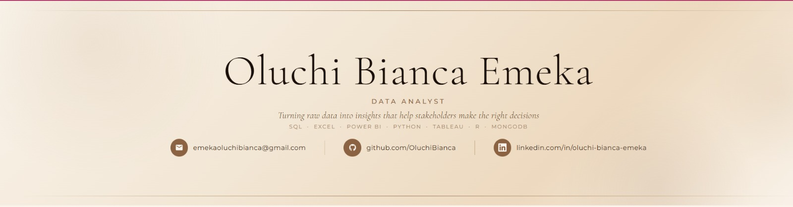

<!-- TYPING ANIMATION HEADER -->

---

---
🤎 About Me
```python
oluchi = {
    "name"       : "Oluchi Bianca Emeka",
    "role"       : "Data Analyst",
    "industries" : ["Healthcare", "Sales", "Marketing",
                    "Finance", "Social Media", "Operations"],
    "tools"      : ["SQL", "Python", "Power BI", "Tableau",
                    "Excel", "R", "Google Sheets", "MongoDB"],
    "approach"   : "Business-first. Every analysis starts with a real problem.",
    "status"     : "Open to Data analyst roles & collaborations 🌍"
}
```
> *"Without data, you're just another person with an opinion."* — W. Edwards Deming
---
🛠️ My Tech Stack
Query & Code


Visualise & Report


Data & Databases


---
📁 Portfolio Projects
	Project	Industry	Tools	Status
🏥	Hospital Readmission Risk Analysis	Healthcare	Python, Matplotlib	🔄 In Progress
📈	Retail Sales Performance Analysis	Sales	Excel, Power BI	🔄 In Progress
📣	Marketing Campaign ROI Analysis	Marketing	Python, Tableau	🔜 Coming Soon
💰	Personal Finance Spending Dashboard	Finance	Excel, Power BI	🔜 Coming Soon
📱	Social Media Engagement Analysis	Social Media	Python, Seaborn	🔜 Coming Soon
⚙️	Supply Chain Delay & Inventory Analysis	Operations	SQL, Excel	🔜 Coming Soon
> Every project follows the **STAR framework** — Situation · Task · Action · Result — with real business recommendations.
---
📊 My GitHub Stats
<p align="center">
  
  &nbsp;
  
</p>
---
🧠 My Analytical Process
```
📥 Receive data         →   Ask: what business problem does this solve?
🧹 Clean & validate     →   Remove noise, handle nulls, fix formats
🔍 Explore (EDA)        →   Find patterns, outliers, relationships
📊 Visualise            →   Make the story visible and clear
💡 Insight              →   What does this actually mean for the business?
✅ Recommend            →   What should the business DO about it?
```
---
🌍 Let's Connect
<p align="center">
  <a href="https://www.linkedin.com/in/oluchi-bianca-emeka/">
    
  </a>
  &nbsp;
  <a href="mailto:emekaoluchibianca@gmail.com">
    
  </a>
</p>
---
<p align="center">
  
</p>
<p align="center">
  <i>Currently building · Always learning · Open to opportunities 🤎</i>
</p>